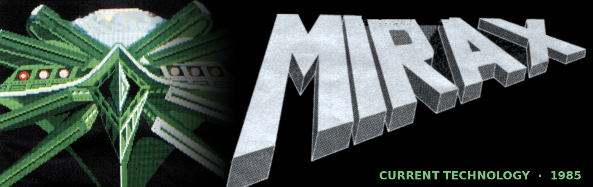
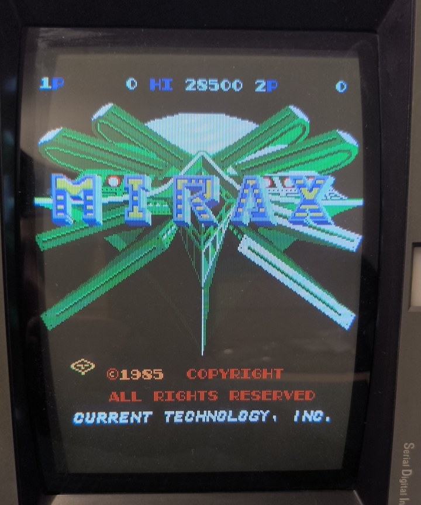
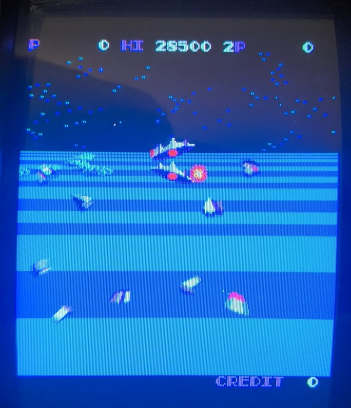
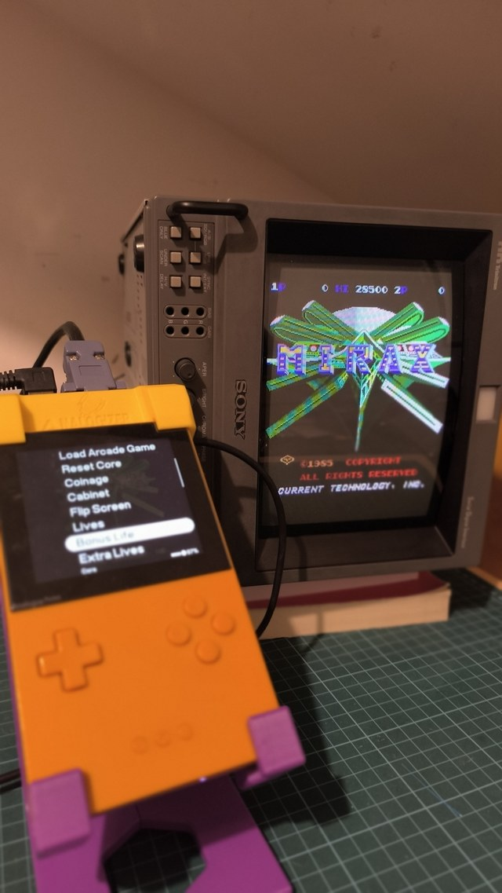
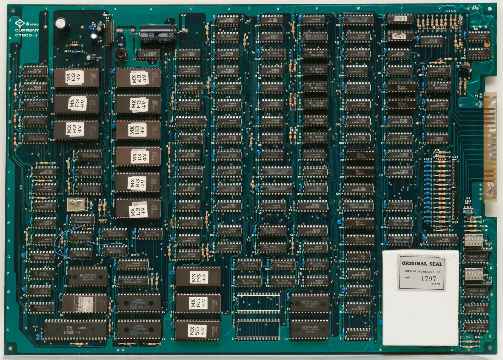
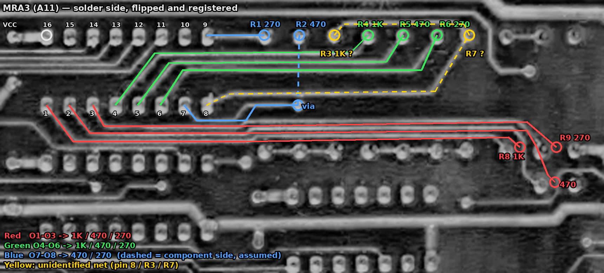

<p align="center">
  
</p>

<h1 align="center">Mirax — Arcade core for Analogue Pocket</h1>

<p align="center">
  
  
  
  
  
</p>

<p align="center">
  <i>"The invaders from the ALPHA CENTAURI EMPIRE are building their super laser weaponry in the city of MIRAX.<br>
  Your MISSION: destroy all weapon construction units before it is too late."</i><br>
  — original 1985 flyer
</p>

---

## Contents

1. [Introduction](#1-introduction)
2. [Experimental status and accuracy](#2-experimental-status-and-accuracy)
3. [Installation](#3-installation)
4. [Generating the ROM file](#4-generating-the-rom-file)
5. [Controls](#5-controls)
6. [Analogizer support](#6-analogizer-support)
7. [Core settings](#7-core-settings)
8. [Hardware notes](#8-hardware-notes)
9. [Revision history](#9-revision-history)
10. [Acknowledgements](#10-acknowledgements)
11. [License](#11-license)

---

## 1. Introduction

**Mirax** is a 1985 first-person space shooter by **Current Technology, Inc.** (Taipei, Taiwan). You fly towards the giant space city of Mirax over a striped pseudo-3D ground, shooting enemy formations on a 90,000-mile journey before destroying the weapon construction units.

This core is an FPGA reimplementation of the **CURRENT CT805-3** board (MAME set `miraxa`) for the **Analogue Pocket**, with analog video output through the **Analogizer** adapter.

| Title screen (Sony PVM via Analogizer) | In game |
|:---:|:---:|
|  |  |

Main features:

- Two Z80 CPUs (the main program stays encrypted in ROM and is decrypted on the bus) and two AY-3-8912 sound chips.
- Tilemap with per-column scroll and a 128-sprite line-buffer renderer.
- 64-entry RGB332 colour palette from the two original colour PROMs.
- Analog RGBS / Y/C / YPbPr / CVBS output and SNAC controllers through the Analogizer.
- Game pauses automatically when the Pocket menu is opened.

## 2. Experimental status and accuracy

> [!WARNING]
> **This is an experimental core.** It may contain inaccuracies, and its behaviour can change significantly between versions while the hardware analysis progresses.

The core follows a **hybrid, AI-assisted methodology**. It starts from the MAME driver (`misc/mirax.cpp`), which is used only as a **reference oracle**, and then refines the design from the real board: high-resolution photographs of both PCB sides are registered and used to follow traces and infer how the original TTL logic actually works. The process is iterative.

The goal is not just to port C++ to an FPGA. The project is also an honest test of how useful AI is as a hardware inference and analysis tool, including where it fails.

Every statement about the board that has not yet been measured or traced is recorded as a numbered **hypothesis** and tagged in the RTL source:

- 📄 **[Hypothesis log → docs/hypotheses.md](docs/hypotheses.md)**

Known open points in 0.1 include the exact pixel clock derivation, video timing totals, and the colour DAC resistor weights (the board appears to use 270 Ω where MAME assumes 220 Ω). If you own a Mirax board and can measure any of these, contributions are very welcome.

## 3. Installation

1. Copy the contents of the release archive to the root of your Pocket SD card (`Assets`, `Cores`, `Platforms` and `Presets` folders).
2. Build the ROM file as described in [section 4](#4-generating-the-rom-file).
3. Copy the generated `.rom` file to:
   ```
   /Assets/mirax/common/
   ```
4. Launch **Mirax** from the Pocket *Openfpga* menu and choose **Load Arcade Game**.

## 4. Generating the ROM file

For legal reasons no ROM data is distributed with the core. You need your own dumps of the MAME sets **`mirax`** (parent) and **`miraxa`** (clone, the set this core targets), and the `.mra` file included in this repository.

Use MRAtool (check tools/mra-tool folder and the associated .mra files) to create the required rom files and place inside of `/Assets/mirax/common` folder:

| :Name:                     | ROM Name    |
| :------------------------- | :---------- |
| Mirax (Set 1)              | mirax.rom   |
| Mirax (Set 2)              | miraxa.rom  |
| Mirax (Set 3)              | miraxb.rom  |

The result is a single `.rom` file of **205,376 bytes** (`0x32040`) with this layout:

   | Offset | Size | Contents |
   |---|---|---|
   | `0x00000` | 48 KB | Main CPU program (kept encrypted, decrypted on the bus) |
   | `0x0C000` | 8 KB | Sound CPU program |
   | `0x0E000` | 48 KB | Tiles (3 planes) |
   | `0x1A000` | 96 KB | Sprites (3 planes) |
   | `0x32000` | 64 B | Colour PROMs MRA3 + MRB3 |

If the size is different, check that both zips are present and match the MAME set.

## 5. Controls

The core can output RGBS, RGsB, YPbPr, Y/C and SVGA scandoubler (50% scanlines) video signals.
| Video output | Status | SOG Switch(Only R2,R3 Analogizer) |
| :----------- | :----: | :-------------------------------: |     
| RGBS         |  ✅    |     Off                           |
| RGsB         |  ✅    |     On                            |
| YPbPr        |  ✅🔹  |     On                            |
| Y/C NTSC     |  ✅    |     Off                           |
| Y/C PAL      |  ✅    |     Off                           |
| Scandoubler  |  ✅    |     Off                           |

🔹 Tested with Sony PVM-9044D

| :SNAC game controller:                           | Analogizer A/B config Switch | Status |
| :----------------------------------------------- | :--------------------------- | :----: |
|  DB15                                            | A                            |  ✅    |
|  NES                                             | A                            |  ✅    |
|  SNES                                            | A                            |  ✅    |
|  PCENGINE                                        | A                            |  ✅    |
|  PCE MULTITAP                                    | A                            |  ✅    |
|  PSX DS/DS2 Digital DPAD                         | B                            |  ✅    |
|  PSX DS/DS2 Analog  DPAD                         | B                            |  ✅    |
|  PSX DS/DS2 Analog  DPAD                         | B                            |  ✅    |
| *PS/2 Keyboard & Mouse + NES One Player          | A                            |  ✅    |
| *PS/2 Keyboard & Mouse + SNES One Player         | A                            |  ✅    |
| *PS/2 Keyboard & Mouse + DB15 Two Players        | A                            |  ✅    |
|  PS/2 Keyboard & Mouse + No SNAC game controller | A                            |  ✅    |

*With these modes you can used at the same time the keyboard and the enabled SNAC game controller.

For PS/2 Keyboard the following keys are used:

| :Game Control:    | Key         |
| :---------------- | :---------- |
| Player1  Up       | Up Arrow    |   
| Player1  Down     | Down Arrow  |
| Player1  Left     | Left Arrow  |
| Player1  Right    | Right Arrow |
| Player1  Button 1 | L-Ctrl      |
| Player1  Button 2 | L-Alt       |
| Player2  Up       | R           |
| Player2  Down     | F           |
| Player2  Left     | D           |
| Player2  Right    | G           |
| Player2  Button 1 | A           |
| Player2  Button 2 | S           |
| Coin1             | 5           |
| Coin2             | 6           |
| Start1            | 1           |
| Start2            | 2           |
| Pause             | P           |

## 6. Analogizer support



The core supports the [**Analogizer**](https://github.com/RndMnkIII/Analogizer) adapter, which adds:

- **Analog video output** for CRT monitors: RGBS, Y/C (S-Video), YPbPr and composite. The core generates native 15 kHz timing for PVMs and arcade monitors (vertical game).
- **SNAC controllers**, used as player 1 / player 2 inputs.
- **PS/2 keyboard** input (see [section 5](#5-controls)).

Video mode and controller settings are configured the same way as in other Analogizer cores. See the [Analogizer wiki](https://github.com/RndMnkIII/Analogizer/wiki) for wiring and configuration details.

<br clear="right">

## 7. Core settings

Available in the Pocket core menu. Game options mirror the original DIP switches.

| Setting | Description |
|---|---|
| **Load Arcade Game** | Select the `.rom` file |
| **Reset Core** | Restart the game |
| **Coinage** | Coins per credit |
| **Cabinet** | Upright / cocktail |
| **Flip Screen** | Rotate the image 180° |
| **Lives** | Starting lives |
| **Bonus Life** | Score needed for an extra life |
| **Extra Lives** | Extra-life option |
| **Demo Sounds** | Enable sounds in demo mode |
| **Allow Continue** | Enable to continue a game |
| **Auto-Play Mode** | Makes the game to behave like attract mode |
| **Difficulty** | Game difficulty grade |

## 8. Hardware notes

<p align="center">
  
  <br><i>CURRENT CT805-3 board (component side) — the reference for this core.</i>
</p>

| Function | Board components |
|---|---|
| Main CPU | Z80 behind the epoxy-potted "ORIGINAL SEAL" decryption module (hypothesis H-004) |
| Sound CPU | NEC D780C-1 (Z80) at S2, sound ROM `mxr2` at R2 |
| Sound | 2× GI AY-3-8912 (R4, S4), Fujitsu MB3712 power amplifier (A3) |
| Master clock | 12.000 MHz crystal with 74LS368 oscillator (M2) |
| Video timing | 74S161 / 74LS161 counter chain (B9–D12) |
| Sprites | 6× 74S201 256×1 line buffers (C9–H9) |
| Colour | 2× 32×8 colour PROMs (MRA3, MRB3) and a resistor DAC (A12) |

As an example of the analysis process, the colour DAC was reconstructed by flipping and registering the solder-side photograph onto the component side and following the PROM outputs to the resistor network:

<p align="center">
  
  <br><i>MRA3 outputs traced to the colour DAC resistors (hypothesis H-021, pending verification).</i>
</p>

## 9. Build the project
 1. Install Quartus 25.1 Lite (Windows or Linux version)
 2. Clone the repo from https://github.com/RndMnkIII/MiraxPocket.git
 3. cd to MiraxPocket/src/fpga
 4. Open the `ap_core` Quartus project and press `Start Compilation`.
 5. When the compilations ends without errors go to repository main folder and run `pack.bat` or `pack.sh` to 
    build the distribution file.

## 10. Revision history

| Version | Date | Changes |
|---|---|---|
| **0.1** | 2026-09-26 | Initial release (experimental). |

## 11. Acknowledgements

- **Jose Tejada ([jotego](https://github.com/jotego))** — [jt49](https://github.com/jotego/jt49), the AY-3-8910/8912 sound core.
- **Daniel Wallner** — the **T80** Z80 core (T80pa variant), with later fixes by MikeJ, Sorgelig and other contributors.
- **Adam Gastineau ([agg23](https://github.com/agg23))** — openFPGA tools and documentation, the `data_loader` module, and the platform image tools.
- **The MAME team** — the `misc/mirax.cpp` driver, used as the initial reference.
- **[sebdel](https://github.com/sebdel/mra-tools-c)** — mra-tool.
- **Analogue** — the openFPGA platform.
- AI-assisted analysis and documentation by **Claude (Anthropic)**; see [section 2](#2-experimental-status-and-accuracy).

## 12. License

This core is released under the **GNU General Public License v3.0 or later** (`GPL-3.0-or-later`). See [LICENSE](LICENSE).

Third-party components (jt49, T80 and others) keep their original licenses. Mirax is © 1985 Current Technology, Inc.; no ROM data is included in this repository.
