# Mapa interactivo — Current Technology CT805‑3 «Mirax» (1985)

Mapa interactivo de la PCB de doble cara de la placa arcade **CT805‑3 (Mirax)**,
pensado como herramienta para **identificar componentes y pines**, **superponer
las dos caras** de la placa y **reconstruir el esquemático** dibujando trazas,
planos de cobre (GND/VDD) y vías, con **exportación de _netlist_ estilo KiCad**.

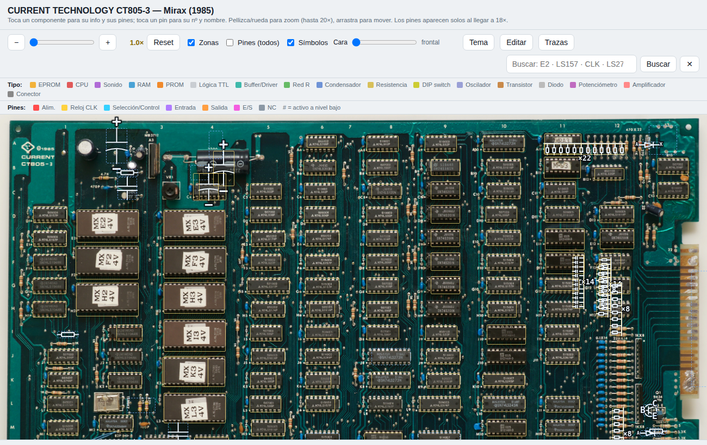

---

## 1. Archivos y puesta en marcha

El paquete son **tres archivos que deben permanecer juntos en la misma carpeta**:

| Archivo | Descripción |
|---|---|
| `mirax_ct805-3_mapa_interactivo.html` | La aplicación (ábrela con doble clic en un navegador; recomendado Chrome). |
| `board_front.webp` | Foto de la **cara frontal** (componentes), sin pérdidas, 5371×3850. |
| `board_back.webp` | Foto de la **cara trasera** (soldadura), alineada a la frontal. |

El HTML carga las dos imágenes por ruta relativa, así que si mueves el `.html`
lleva también las dos `.webp`. No necesita conexión a Internet ni servidor.

> Todo tu trabajo (ediciones, trazas, zonas, vías, marcas, alineación de la
> cara trasera, componentes ocultos) se **guarda automáticamente en el navegador**
> y se recupera al reabrir el archivo.

---

## 2. La barra de herramientas

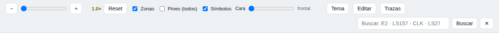

- **Zoom**: botones `−` / `+`, el deslizador, la **rueda del ratón** o pellizco en
  táctil (hasta 20×). `Reset` vuelve a 1×. Arrastra para desplazarte por la placa.
- **Zonas**: muestra/oculta los recuadros de los componentes.
- **Pines (todos)**: muestra todos los pines a la vez (por defecto aparecen solos
  al llegar a **18×**, o al tocar un componente).
- **Símbolos**: muestra/oculta los símbolos esquemáticos de los discretos.
- **Cara**: deslizador de transparencia entre la cara **frontal** y la **trasera**
  (ver §5).
- **Tema**: alterna claro/oscuro.
- **Editar** / **Trazas**: entran en los dos modos de trabajo (ver §4 y §6).
- **Buscar**: localiza por referencia o por nombre de pin (p. ej. `E2`, `LS157`,
  `CLK`, `LS273 CLK`, `OE#`).
- **Capas**: abre el panel de capas (ver abajo).

### Panel de capas

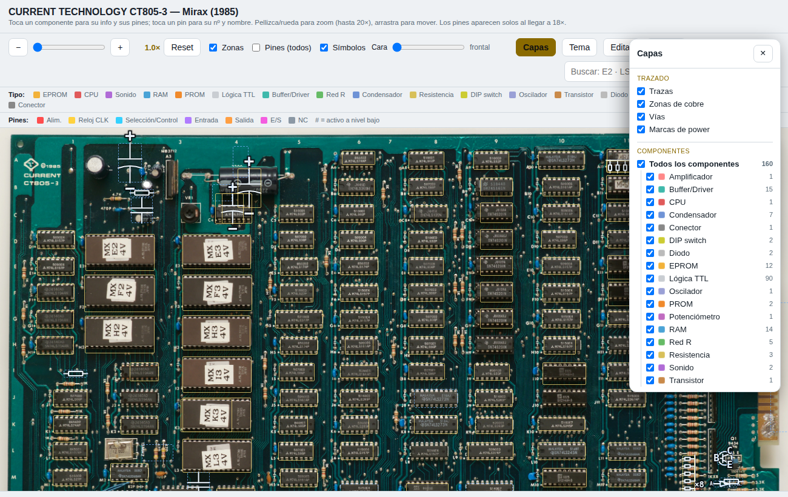

El botón **Capas** abre un panel para **activar/desactivar por separado** cada tipo
de objeto, útil para despejar la vista según lo que estés haciendo:

- **Trazado**: `Trazas`, `Zonas de cobre`, `Vías`, `Marcas de power`.
- **Componentes**: un interruptor maestro **«Todos los componentes»** y, debajo, una
  **subcapa por categoría** (EPROM, CPU, RAM, Lógica TTL, Condensador, Resistencia,
  Diodo, Transistor…) con su color y su recuento. Apaga, por ejemplo, «Resistencia»
  para ocultar solo las resistencias.

Es puramente visual (no afecta a la _netlist_) y está pensado para **ampliarse a más
tipos de objeto** en el futuro con solo añadir una casilla.

---

## 3. Consultar componentes y pines

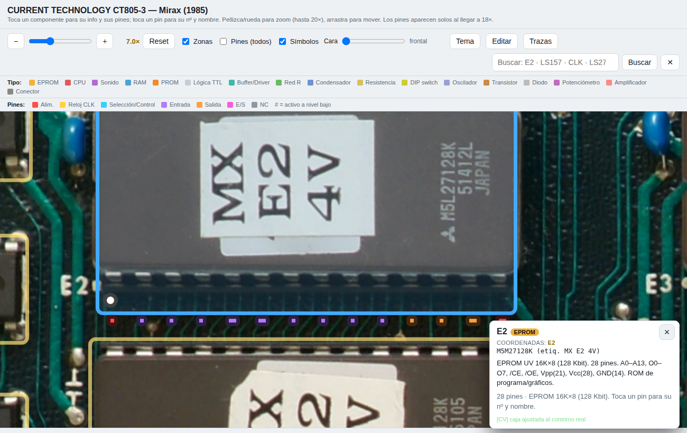

- **Toca un componente** para ver su ficha (referencia, coordenada, tipo,
  encapsulado y descripción) y para **activar sus pines**.
- **Toca un pin** para ver su **número y nombre**. Los pines se dibujan como
  **cuadrados pequeños pegados al borde** de la caja; su color indica la tipología
  (alimentación, reloj, entrada, salida, E/S, selección/control, NC), según la
  leyenda inferior.
- El **círculo blanco** junto a la caja marca el **pin 1** (por el interior).
- En escritorio, pasar el ratón por encima también muestra la información.

Los discretos (resistencias, condensadores, condensadores polarizados, diodos,
transistores, interruptores DIP y arrays de resistencias) se dibujan con su
**símbolo esquemático** y sus pines identificados.

---

## 4. Editor de componentes

Pulsa **Editar** para colocar, orientar e identificar cajas. Selecciona un
componente (clic) y aparece el panel de edición.

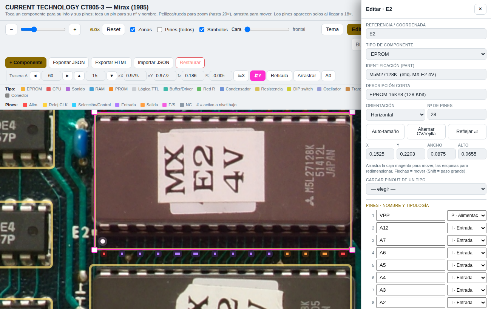

Puedes:

- Cambiar **referencia**, **tipo de componente**, **identificación (part)** y
  **descripción**.
- Ajustar **orientación** (horizontal/vertical), **reflejo (flip)**, **nº de pines**
  y las coordenadas **X/Y/Ancho/Alto** (o arrastrar la caja magenta y sus esquinas;
  flechas para mover, Shift = paso grande).
- **Cargar el pinout de un tipo** existente o **crear un tipo nuevo** (encapsulado,
  nº de pines y nombre + tipología de cada pin).
- Editar **pin a pin** el nombre y la tipología.
- **Duplicar** o **eliminar** el componente.
- **Calculadora de código de colores** de resistencias (4 y 5 bandas) para asignar
  el valor como identificación.

Botones de la barra de edición: **Exportar JSON** / **Exportar HTML** (genera una
copia del mapa con todo lo editado incrustado), **Importar JSON** y **Restaurar**
(vuelve al estado original del archivo).

---

## 5. Segunda capa: la cara trasera

La placa es de **dos capas**. El deslizador **Cara** funde la imagen frontal con la
trasera: al mínimo solo se ve la cara de componentes, al máximo solo la trasera, y
en medio una mezcla para seguir las pistas de una cara a la otra.

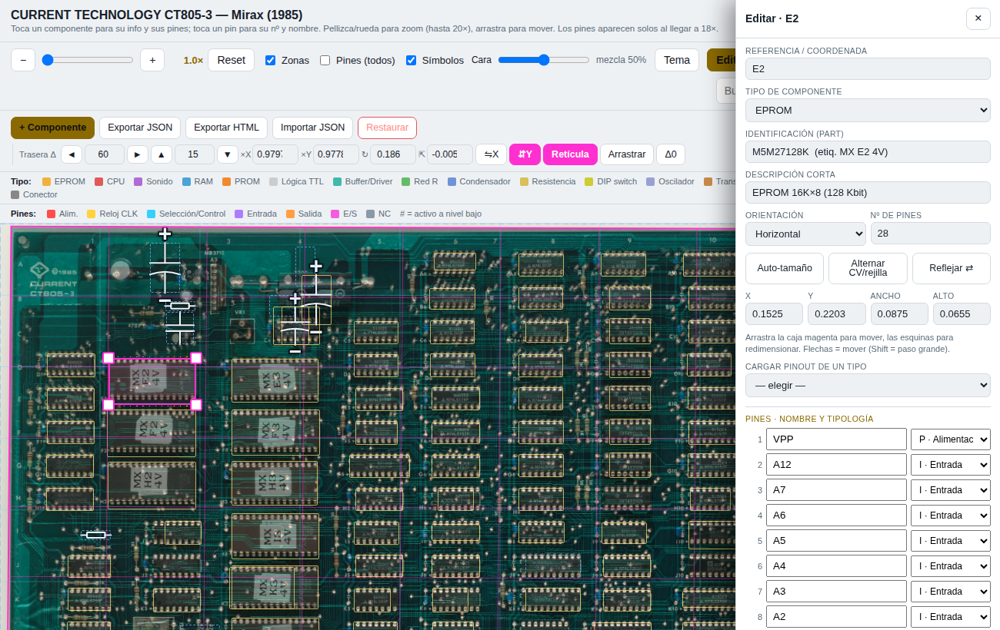

En **modo Editar** aparecen los controles de alineación de la trasera («Trasera Δ»):

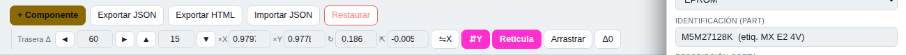

- **◄ ► ▲ ▼** y campos **X / Y**: desplazamiento en píxeles de imagen.
- **×X / ×Y**: escala independiente (origen en la esquina superior izquierda).
- **↻**: rotación en grados · **⇱**: cizalla (shear).
- **⇋X / ⇵Y**: voltear la trasera en horizontal / vertical.
- **Retícula**: dibuja una malla que muestra la transformación aplicada (magenta)
  frente al marco de referencia (azul).
- **Arrastrar**: mueve la trasera con el ratón para afinar la alineación.
- **Δ0**: pone la transformación a identidad.

> El archivo viene con una **alineación automática por defecto** (calculada a partir
> de la rejilla de taladros pasantes: la trasera va con volteo vertical + un ligero
> ajuste de escala/rotación). `Restaurar` vuelve a esa alineación.

---

## 6. Modo Trazas — reconstruir el esquemático

Pulsa **Trazas** para abrir la barra de trazado:

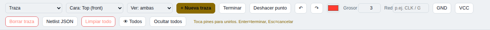

El desplegable **Tipo** elige qué dibujas: **Traza**, **Zona (plano)**,
**Vía (unión de caras)**, **Marca power (pin)** u **Ocultar/mostrar comp.**
Los desplegables **Cara** (Top/Bottom) y **Ver** (ambas / solo Top / solo Bottom)
controlan a qué capa pertenece lo nuevo y qué capas se muestran.

### 6.1. Dibujar trazas

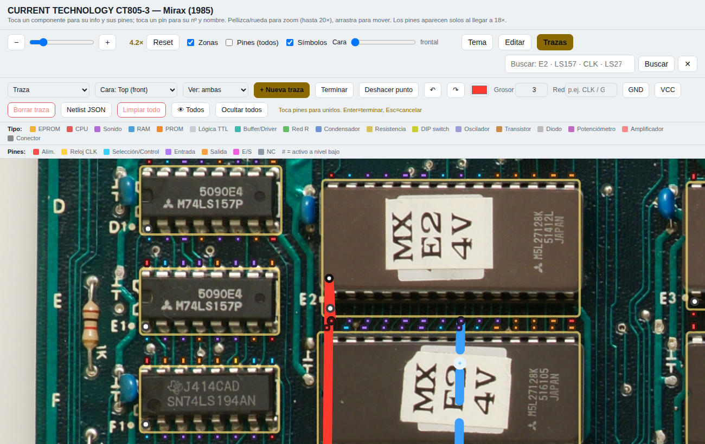

1. Elige **Cara** (Top/Bottom), color y grosor.
2. **+ Nueva traza** y ve **tocando los pines**: cada punto hace *snap* al pin más
   cercano (los vértices anclados a un pin se marcan en verde).
3. **Enter** o **Terminar** cierra la traza; **Esc** cancela; **Deshacer punto** /
   **Retroceso** quita el último punto.
4. Fuera de dibujo, **toca una traza** para seleccionarla (recolorear, cambiar
   grosor, red o cara, o **Borrar traza**). Un vértice suelto se puede **arrastrar**.

Diferenciación de caras: **Top = línea sólida**, **Bottom = línea discontinua**;
las etiquetas llevan sufijo **·T / ·B**.

### 6.2. Zonas / planos de cobre (GND, VDD…)

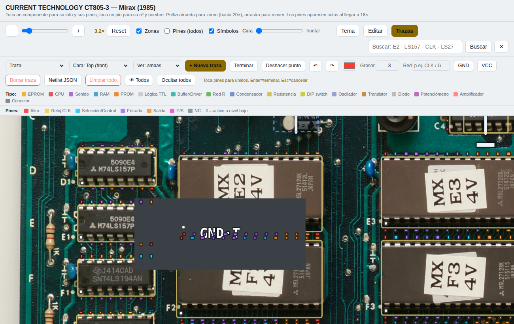

Con **Tipo → Zona**, escribe el nombre de red (botones rápidos **GND** / **VCC**)
y marca el contorno del polígono (mín. 3 vértices; **Enter** lo cierra). El plano se
rellena translúcido con la etiqueta de su red y **conecta eléctricamente todos los
pines que encierra y las trazas que toca**.

#### Huecos en una zona (islas vacías)

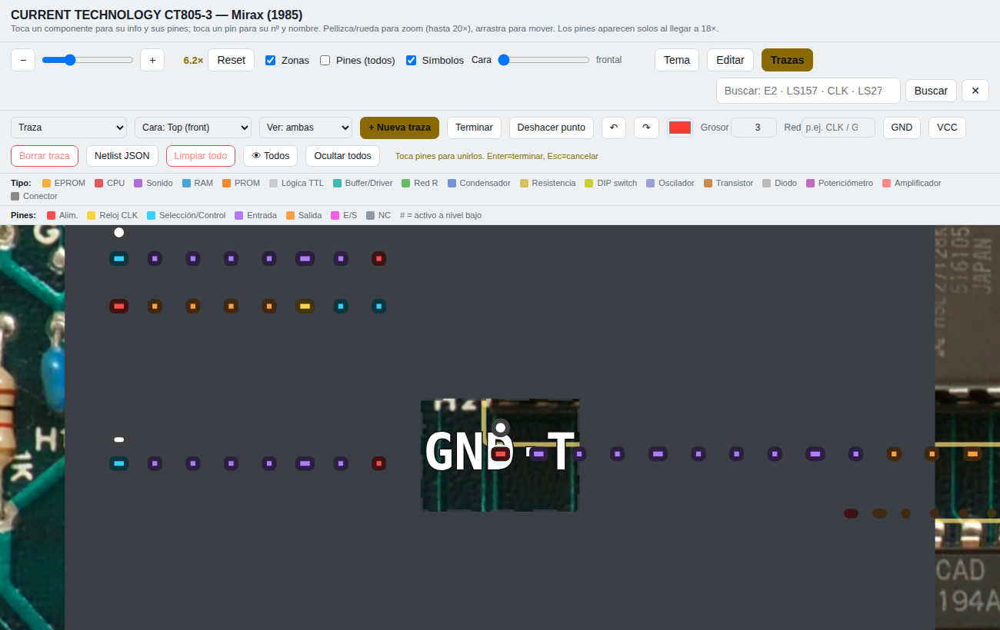

Los planos pueden tener **regiones interiores vacías** (por ejemplo, una isla
alrededor de una vía que viene de la otra cara). Con **Tipo → Hueco en zona**:

1. **Toca la zona** que quieres recortar para seleccionarla.
2. Pulsa **+ Nuevo hueco** y marca el contorno interior a vaciar (**Enter** lo cierra).

El hueco se recorta del relleno (se ve la placa a través) y es **eléctricamente
neutro**: los pines o vías que caigan dentro del hueco **no** se conectan a ese plano.

### 6.3. Redes de alimentación (power)

Las redes cuyo nombre es **GND/VSS/AGND/DGND** o **VCC/VDD/VEE/+5V/+12V/-5V…** se
tratan como **alimentación**: son **globales por nombre** (todo lo llamado «GND» es la
misma red en toda la placa) y con color propio (masa gris, tensión rojo). **GND y VCC
son redes independientes** y no se fusionan; si un pin quedara reclamado por dos redes
de power distintas se marca como **⚠ conflicto**.

### 6.4. Marcas de power (pin → red)

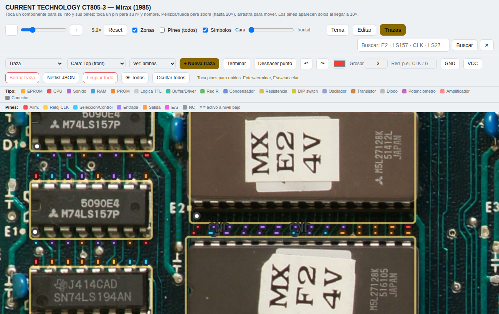

Con **Tipo → Marca power**, toca pines para aterrizarlos a la red indicada (símbolo de
masa ⏚ para GND, barra para VCC/tensión). Ideal para conectar muchos pines a masa sin
dibujar trazas.

### 6.5. Vías (unión entre caras)

Con **Tipo → Vía**, toca un punto (hace *snap* a un vértice de traza o a un pin) para
crear una **vía** (anillo). La vía **une eléctricamente ambas caras** en ese punto:
conecta los pines/trazas coincidentes y **cose los planos que la contienen** —una vía
dentro de una zona Top y una zona Bottom las une **aunque no encierren ningún pin**
(por geometría). Vuelve a tocarla para quitarla.

### 6.6. Ocultar / mostrar componentes

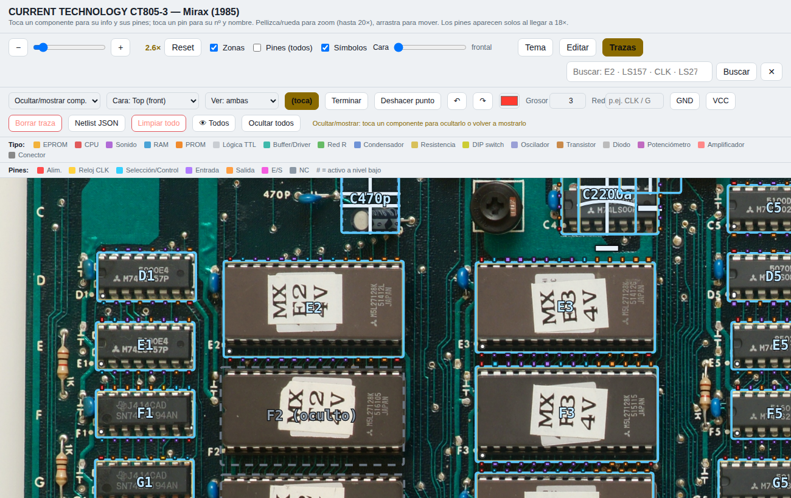

Con **Tipo → Ocultar/mostrar comp.** el mapa muestra el contorno de todos los
componentes; **toca uno para ocultarlo o volver a mostrarlo**. Un componente oculto
pierde su caja, símbolo y pines (y deja de *snapear*), para no estorbar al trazar.
Botones **Ocultar todos** (solo pistas) y **👁 Todos**. Los ocultos siguen contando en
la _netlist_ si un plano los encierra o una traza los toca.

### 6.7. Deshacer / rehacer

Historial multinivel (hasta 150 pasos) sobre trazas, zonas, marcas y vías. Botones
**↶ / ↷** y atajos **Ctrl+Z** / **Ctrl+Y** (o **Ctrl+Shift+Z**).

---

## 7. Exportar la _netlist_ (estilo KiCad)

**Netlist JSON** descarga un archivo con los componentes, las **redes** (agrupadas por
conectividad y por nombre global de power), los conflictos detectados y la geometría
de trazas/zonas/marcas/vías (con su cara). Estructura resumida:

```json
{
  "source": "CT805-3 Mirax — mapa interactivo",
  "components": [ { "ref": "E2", "value": "M5M27128K", "cat": "eprom" } ],
  "nets": [
    { "code": 1, "name": "GND", "class": "power", "is_power": true,
      "nodes": [
        { "ref": "E2", "pin": "14", "pinfunction": "GND", "pintype": "power_in" },
        { "ref": "F2", "pin": "14", "pinfunction": "GND", "pintype": "power_in" }
      ] },
    { "code": 2, "name": "N$2", "class": "signal", "is_power": false,
      "nodes": [ { "ref": "E2", "pin": "10", "pinfunction": "O0", "pintype": "output" } ] }
  ],
  "conflicts": [],
  "copper_zones": {
    "count": 1,
    "groups": [
      { "id": "Z1", "zones": [0, 1], "layers": ["top", "bottom"],
        "nets": ["+5V"], "joined_by": ["1 vía"] }
    ],
    "islands": []
  },
  "traces": [ { "net": "", "layer": "top",  "points": [ … ] } ],
  "pours":  [ { "net": "GND", "layer": "bottom", "points": [ … ], "holes": [ [ … ] ] } ],
  "flags":  [ { "net": "GND", "ref": "E2", "pin": 14 } ],
  "vias":   [ { "x": 0.51, "y": 0.42 } ]
}
```

### Análisis de conectividad de cobre (`copper_zones`)

Como las redes (`nets`) se basan en **pines**, dos planos de cobre que no encierran
ningún pin no aparecerían como red. Por eso la netlist incluye además
**`copper_zones`**, un análisis **puramente geométrico** que agrupa las zonas por cobre
realmente conectado y explica **por qué** están unidas:

- **`groups`**: cada grupo lista las `zones` (índices), las `layers` implicadas, los
  nombres de red presentes y `joined_by` (motivo de la unión): `"solape"` (misma cara
  que se tocan), `"N vía(s)"` (una vía dentro de ambas, une Top↔Bottom) o
  `"N pin(es)"` (un pin pasante dentro de ambas).
- **`islands`**: avisa cuando **el mismo nombre de red aparece en grupos distintos**
  (p. ej. dos planos `+5V` sin conectar). En la barra de trazas verás en vivo algo
  como `Cobre: 2 grupos · ⚠ +5V en 2 islas`.

Así respondes directamente a *«¿están conectadas estas dos zonas?»* aunque no haya
ningún pin de por medio.

---

## 8. Guardado, exportación e importación

- **Automático**: todo se guarda en el navegador (`localStorage`) y se recupera al reabrir.
- **Exportar JSON** (barra de edición): vuelca *todo* el mapa
  `{ comps, backOffset, traces, pours, flags, vias }` para reprocesarlo o compartirlo.
- **Exportar HTML**: genera una copia del `.html` con todo incrustado (sigue
  necesitando las dos `.webp` al lado).
- **Importar JSON**: recarga un volcado previo (acepta también el formato antiguo).
- **Restaurar**: vuelve al estado original del archivo (descarta ediciones y alineación).
- **Reset total (caché)**: **borra todo lo que la página ha guardado en el navegador**
  (ediciones de componentes, tipos creados, alineación de la trasera, trazas, zonas,
  huecos, marcas y vías) y recarga al estado original del archivo. Úsalo para empezar
  de cero; no se puede deshacer.

---

## 9. Atajos de teclado (modo Trazas)

| Tecla | Acción |
|---|---|
| **Enter** | Terminar la traza / cerrar la zona en curso |
| **Esc** | Cancelar el elemento en curso |
| **Retroceso** | Quitar el último punto |
| **Ctrl/⌘ + Z** | Deshacer |
| **Ctrl/⌘ + Y** · **Ctrl/⌘ + Shift + Z** | Rehacer |

---

## 10. Notas y limitaciones

- Algunos pinouts (SRAM, PSG, ciertos 74xx) son **aproximados**: verifícalos con el
  _datasheet_ (la ficha lo indica con «pinout aprox.»).
- La alineación de la cara trasera es **afín** (escala/rotación/cizalla/traslación),
  no corrige perspectiva total; queda muy buena y siempre puedes afinarla a mano.
- Las vías conectan por **coincidencia de punto**: al cambiar de capa, termina la
  traza de una cara en el punto de la vía y empieza la de la otra ahí mismo (el *snap*
  a vértice ayuda a clavarlo).

---

*Herramienta de documentación e ingeniería inversa fidelidad‑primero para el core
FPGA de Mirax. Las fotos son la única fuente; los datos se corrigen a partir de ellas.*
